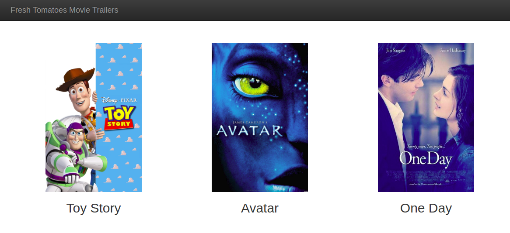

## Movie Trailer Website
 The Movie Trailer Website project consists of server-side code to store a list of movies titles, along with its respective box art imagery and movie trailer website.

Here is the screenshot:



## Download
- if you've installed Git: `git clone git clone https://github.com/conghiaa/movies-trailer-website.git`
- otherwise, click **download button** on the right-top side.

## Setup
> Install **Python**

## Usage
Open terminal in your computer and type:
```
cd movieTrailierWebsite
python entertaiment_center.py
```
